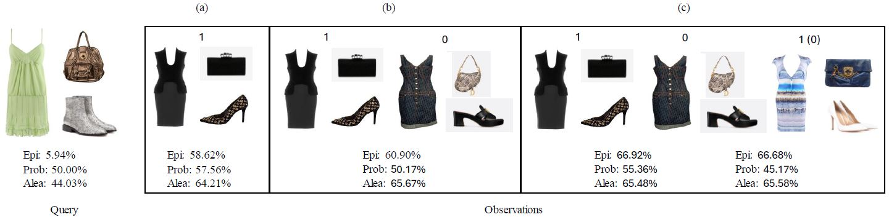
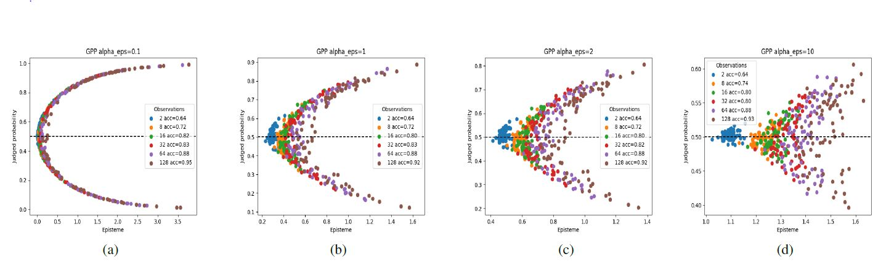

# Gaussian Processes for Modeling Fashion Brand DNA: Classification and Identity Fuzziness
## WACV 2026 | Paper ID 1321

##

## Dataset summary
| Dataset   |  Train |  Val  |  Test |  Total |
|-----------|--------|-------|-------|--------|
| Luxury101 | 11,743 | 1,678 | 3,356 | 16,777 |
| Luxury24  | 7,340  | 1,043 | 2,070 | 10,453 |
| Brand5    | 700    | 100   | 200   | 1,000  |

## Download Dataset
### Luxury101 dataset
Download from Google Drive [Luxury101](https://drive.google.com/file/d/16MERWudbMn0iGfZivEAiP-gehh1yV-DS/view?usp=sharing)

Store the dataset to the [datasets/fashion_brands](datasets/fashion_brands)

### Luxury24 dataset
The Luxury24 dataset can be split from the JSON file of  [Luxury101](https://drive.google.com/file/d/16MERWudbMn0iGfZivEAiP-gehh1yV-DS/view?usp=sharing)

### Brand5 dataset
Download from Google Drive [Brand5](https://drive.google.com/file/d/17-gXTL9S9ugUQwHduZeerYeyRpH0qHDe/view?usp=sharing)

Store the dataset to the [datasets/fashion_brands_looks](datasets/fashion_brands_looks)

## Environment Installation
pip install -r requirements.txt

## Training GP
Run the file:  [fashion_gp/run_model.py](fashion_gp/run_model.py)

## Reproducing the Results

### Reproduce Figure 3 in the paper
### Follow  📄 [fig3_brand_fuzziness_visual.ipynb](fig3_brand_fuzziness_visual.ipynb): 

How the judged probability and the uncertainty measures change as more observations are given to the model.

### Reproduce Figure 5 and 8 in the paper

### Follow 📄 [fig5n8_brand_fuzziness.ipynb](fig5n8_brand_fuzziness.ipynb):  

The relationship between judged probability and episteme of positive labels using GPF.

