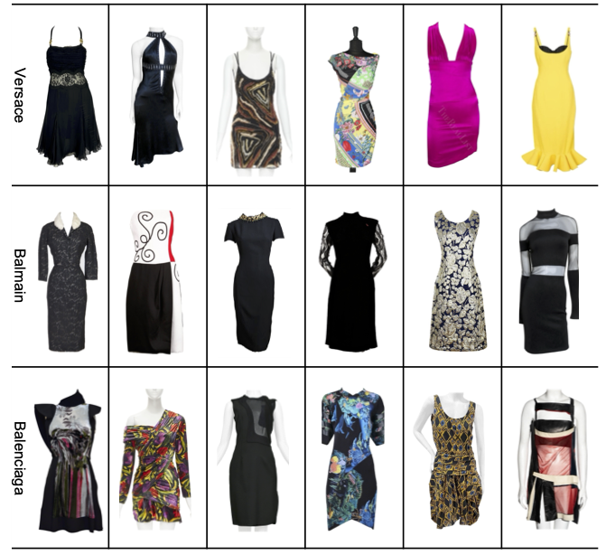
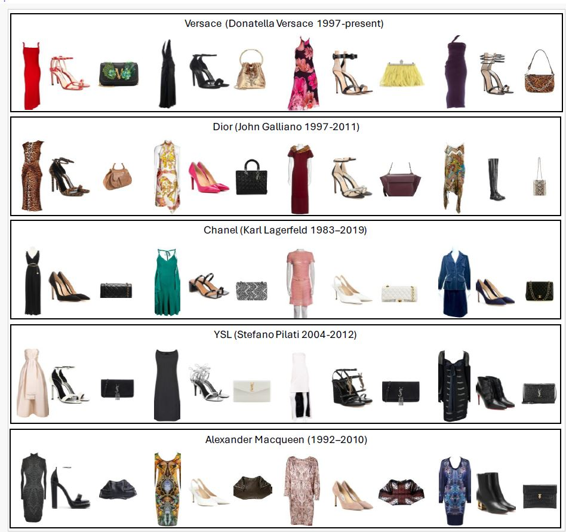
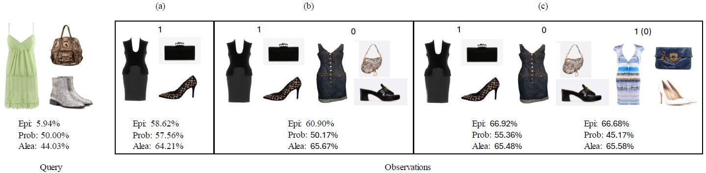
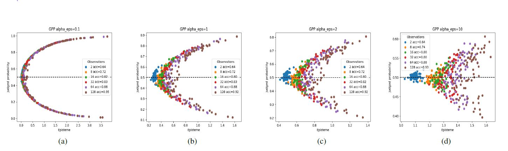

# Gaussian Processes for Modeling Fashion Brand DNA: Classification and Identity Fuzziness
### Anonymous

A distinct style and strong identity define luxury branding. This paper explores fashion DNA from a visual identity perspective. While existing studies focus on logo recognition using visual or textual cues, we instead examine abstract visual features across multiple collections. We address two challenges: (1) classifying dresses by brand—a task more complex than general fashion category classification—and (2) analyzing the fuzziness of brand identity through complete fashion looks. These looks, which include a dress, shoes, and a bag, offer a more holistic representation of a brand’s aesthetic than single-item analysis.
To achieve these goals, we develop a multitask Gaussian process (GP) model that is based on DirichletGP with uncertainty-aware probing. The model leverages representations from pre-trained deep neural networks and learns the distribution of classifiers across different brands and designers, enabling efficient recognition of brand identity and analysis of fuzziness. It can explore brand identity even with a small amount of fashion data, which differs from data-driven methods. Aligning with the tasks, Luxury101 and brand5 datasets are collected to test the performance of the GP model. Experimental results demonstrate that the GP model can serve as a data-efficient and uncertainty-aware tool for understanding brand identity and identifying fuzziness among different brands. We also evaluate the GP model on additional datasets (CIFAR-100 and Fashion MNIST) to demonstrate its generalisability and scalability.
This study is the first to explore brand identity classification and fuzziness learning using a GP with uncertainty-aware probing, offering a novel, scalable approach for understanding abstract brand identity in a measurable and visually interpretable way.

## Dataset summary
| Dataset   |  Train |  Val  |  Test |  Total |
|-----------|--------|-------|-------|--------|
| Luxury101 | 11,743 | 1,678 | 3,356 | 16,777 |
| Luxury24  | 7,340  | 1,043 | 2,070 | 10,453 |
| Brand5    | 700    | 100   | 200   | 1,000  |

## Download Dataset
### Luxury101 dataset
Download from Google Drive [Luxury101](https://drive.google.com/file/d/16MERWudbMn0iGfZivEAiP-gehh1yV-DS/view?usp=sharing)
Store the dataset to the [datasets/fashion_brands](datasets/fashion_brands)

<figure>
  
  <figcaption>Sample images of luxury brands on our dataset.</figcaption>
</figure>

### Luxury24 dataset
The Luxury24 dataset can be split from the JSON file of  [Luxury101](https://drive.google.com/file/d/16MERWudbMn0iGfZivEAiP-gehh1yV-DS/view?usp=sharing)

### Brand5 dataset
Download from Google Drive [Brand5](https://drive.google.com/file/d/17-gXTL9S9ugUQwHduZeerYeyRpH0qHDe/view?usp=sharing)

Store the dataset to the [datasets/fashion_brands_looks](datasets/fashion_brands_looks)

<figure>
  
  <figcaption>Sample looks of Brand5 dataset.</figcaption>
</figure>

## Environment Installation
pip install -r requirements.txt

## Training GP
Run the file:  [fashion_gp/run_model.py](fashion_gp/run_model.py)

## Reproducing the Results

### (1) Reproduce Figure 4 in the paper
#### Follow  📄 [fig3_brand_fuzziness_visual.ipynb](fig3_brand_fuzziness_visual.ipynb): 
<figure>
  
  <figcaption>How the judged probability and the uncertainty measures change as more observations are given to the model.</figcaption>
</figure>

### (2) Reproduce other Figures in the paper

#### Follow 📄 [fig4_6_7_brand_fuzziness.ipynb](fig4_6_7_brand_fuzziness.ipynb):  
<figure>
  
  <figcaption>The relationship between judged probability and episteme of positive labels using GPF.</figcaption>
</figure>

### (3) Other details coming soon

